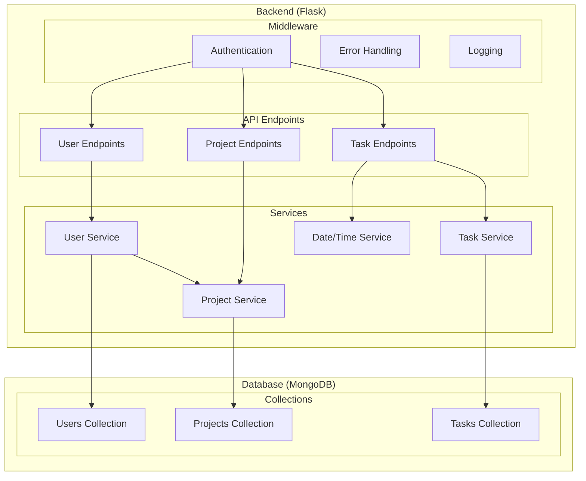

# Advanced Todo

```mermaid
graph TB
subgraph "Backend (Flask)"
subgraph "API Endpoints"
UE[User Endpoints]
PE[Project Endpoints]
TE[Task Endpoints]
end

        subgraph "Services"
            US[User Service]
            PS[Project Service]
            TS[Task Service]
            DTS[Date/Time Service]
        end

        subgraph "Middleware"
            AUTH[Authentication]
            ERR[Error Handling]
            LOG[Logging]
        end
    end

    subgraph "Database (MongoDB)"
        subgraph "Collections"
            UC[Users Collection]
            PC[Projects Collection]
            TC[Tasks Collection]
        end
    end

    %% Backend connections
    UE --> US
    PE --> PS
    TE --> TS
    TE --> DTS
    US --> PS

    %% Service to Database connections
    US --> UC
    PS --> PC
    TS --> TC

    %% Middleware connections
    AUTH --> UE
    AUTH --> PE
    AUTH --> TE
```
